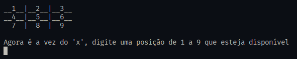
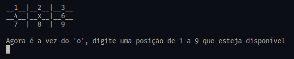
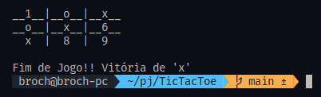
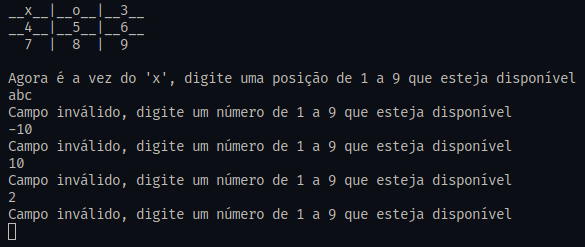
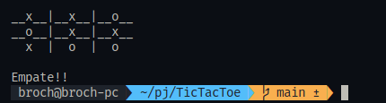

# TicTacToe

- An improved version of [jogo-da-velha-csharp](https://github.com/jonasmachado/jogo-da-velha-csharp)
- [Tutorial Video](https://www.youtube.com/watch?v=4ffSCMF8SHE)

### Version made following the tutorial (with some improvements)

#### Initial Screen

#### Second Turn

#### Win!

#### Validation

#### Draw Game 

